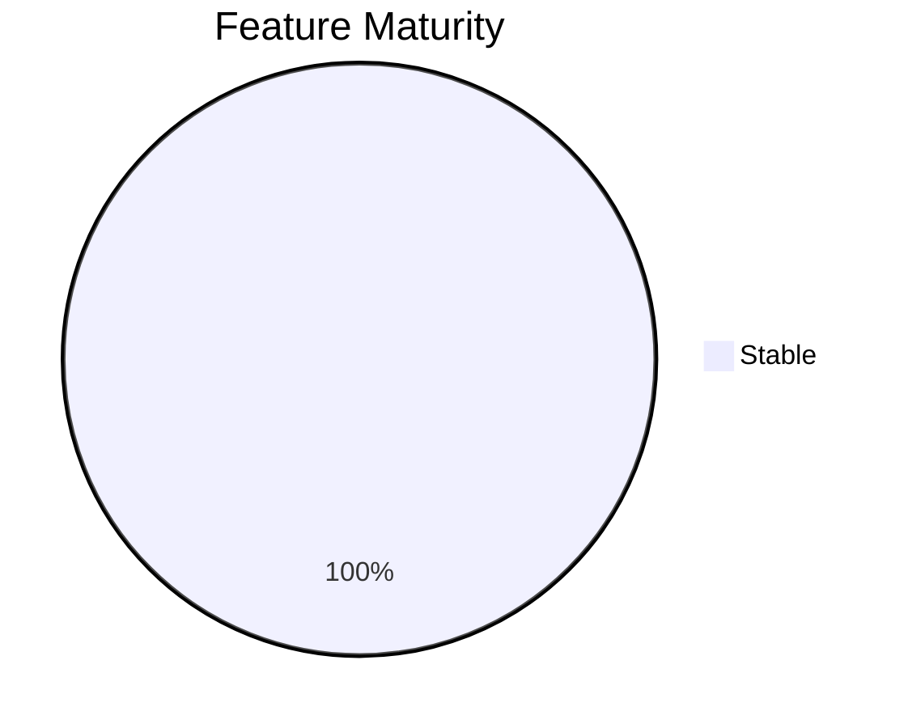
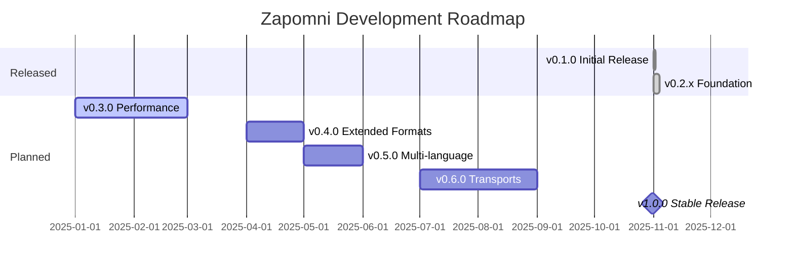

# Roadmap

This document outlines the development roadmap and current status of Zapomni.

## Current Status

**Version**: v0.3.1 (2025-11-28)
**Stage**: Alpha - Production-ready core functionality

| Metric | Value |
|--------|-------|
| MCP Tools | 17 registered |
| Unit Tests | 1,868 passed, 11 skipped |
| E2E Tests | **88 passed, 1 xfailed** |
| Total Tests | **~1,957** |
| Coverage | 74-89% (module-dependent) |
| Test Runtime | ~37 seconds (unit) |
| Python Files | 80 |
| Lines of Code | ~29,500 |

### Feature Status

| Feature | Status | Flag |
|---------|--------|------|
| Memory Operations | Stable | - |
| Hybrid Search | Stable | `ENABLE_HYBRID_SEARCH=true` |
| Knowledge Graph | Stable | `ENABLE_KNOWLEDGE_GRAPH=true` |
| Code Indexing | Stable | `ENABLE_CODE_INDEXING=true` |
| Semantic Cache | Stable | `ENABLE_SEMANTIC_CACHE=true` |
| Git Hooks | Stable | - |
| Workspaces | Stable | - |
| E2E Testing | Stable | 115 tests |

## Version History

### v0.3.x - Performance & Bug Fixes

| Version | Date | Highlights |
|---------|------|------------|
| v0.3.1 | 2025-11-28 | **Fix**: index_codebase now stores file content (Issue #2) |
| v0.3.0 | 2025-11-27 | Performance benchmarking, E2E tests complete |

### v0.2.x - Foundation Complete

| Version | Date | Highlights |
|---------|------|------------|
| v0.2.2 | 2025-11-27 | Feature flags connected to code, enabled by default |
| v0.2.1 | 2025-11-27 | 4 missing tools registered, 95+ test fixes |
| v0.2.0 | 2025-11-25 | Phase 2 (Enhanced Search) + Phase 3 (Code Intelligence) |

### v0.1.x - Initial Release

| Version | Date | Highlights |
|---------|------|------------|
| v0.1.0 | 2025-11-24 | Initial release: 17 MCP tools, 2135 tests, Git Hooks |

## Roadmap

### v0.3.0 - Performance & Stability

**Target**: Q1 2025
**Focus**: Production hardening

**Planned**:
- [ ] Performance benchmarking and optimization
- [ ] Query caching and index tuning
- [ ] Memory usage optimization for large graphs
- [ ] Connection pooling improvements
- [ ] Load testing validation (Locust)

**KPIs**:
- Search latency < 200ms (P95)
- Support 100K+ memories
- Concurrent requests: 8+

### v0.4.0 - Extended Formats

**Target**: Q2 2025
**Focus**: Document processing expansion

**Planned**:
- [ ] Markdown processing improvements
- [ ] Excel/CSV support
- [ ] Image OCR integration
- [ ] Audio transcription support
- [ ] Video transcript indexing

**KPIs**:
- 10+ supported formats
- Processing speed < 1s per page

### v0.5.0 - Multi-language & i18n

**Target**: Q2 2025
**Focus**: International support

**Planned**:
- [ ] Multi-language embeddings (multilingual-e5)
- [ ] Non-English entity extraction
- [ ] Language detection
- [ ] Cross-language search

**KPIs**:
- Support 10+ languages
- Cross-language search accuracy > 80%

### v0.6.0 - Advanced Transports

**Target**: Q3 2025
**Focus**: Deployment flexibility

**Planned**:
- [ ] HTTP/SSE transport (production-ready)
- [ ] WebSocket support
- [ ] gRPC transport option
- [ ] Docker image optimization
- [ ] Kubernetes deployment manifests

**KPIs**:
- < 100ms transport overhead
- Container image < 500MB

### v1.0.0 - Stable Release

**Target**: Q4 2025
**Focus**: Production stability

**Requirements for v1.0**:
- [ ] API stability guarantee
- [ ] Comprehensive documentation
- [ ] Migration guides
- [ ] Security audit complete
- [ ] Performance benchmarks published
- [ ] 90%+ test coverage
- [ ] Zero critical/high CVEs

## Future Considerations (v1.x+)

These features are under consideration for post-1.0 releases:

### Shadow Documentation
Automatic documentation generation from code changes:
- Track code modifications
- Generate change summaries
- Build documentation graphs

### Cross-Project Intelligence
Link knowledge across multiple repositories:
- Shared entity resolution
- Cross-project search
- Dependency analysis

### Real-time Collaboration
Multi-user memory sharing:
- Workspace permissions
- Change synchronization
- Conflict resolution

### Advanced Analytics
Insights and visualization:
- Usage analytics dashboard
- Knowledge graph visualization
- Memory access patterns

## Success Metrics

### Quality KPIs

| Metric | Current | Target (v1.0) |
|--------|---------|---------------|
| Test Coverage | 74-89% | 90%+ |
| Tests Passing | 99.7% | 100% |
| Critical Bugs | 0 | 0 |
| Documentation | Complete | Complete |

### Performance KPIs

| Metric | Current | Target (v1.0) |
|--------|---------|---------------|
| Search Latency (P95) | < 500ms | < 200ms |
| Memory Capacity | 10K+ | 100K+ |
| Concurrent Users | 4 | 8+ |
| Embedding Cache Hit | 60-68% | 80%+ |

### Adoption KPIs

| Metric | Current | Target (v1.0) |
|--------|---------|---------------|
| GitHub Stars | - | 100+ |
| Active Users | - | 50+ |
| Community PRs | - | 10+ |

## Contributing to the Roadmap

We welcome community input on the roadmap! To suggest features or changes:

1. Open a [GitHub Discussion](https://github.com/alienxs2/zapomni/discussions) for feature ideas
2. Create an [Issue](https://github.com/alienxs2/zapomni/issues) for specific proposals
3. Submit a PR for documentation or implementation

See [CONTRIBUTING.md](CONTRIBUTING.md) for guidelines.

---

**Last Updated**: 2025-11-27
