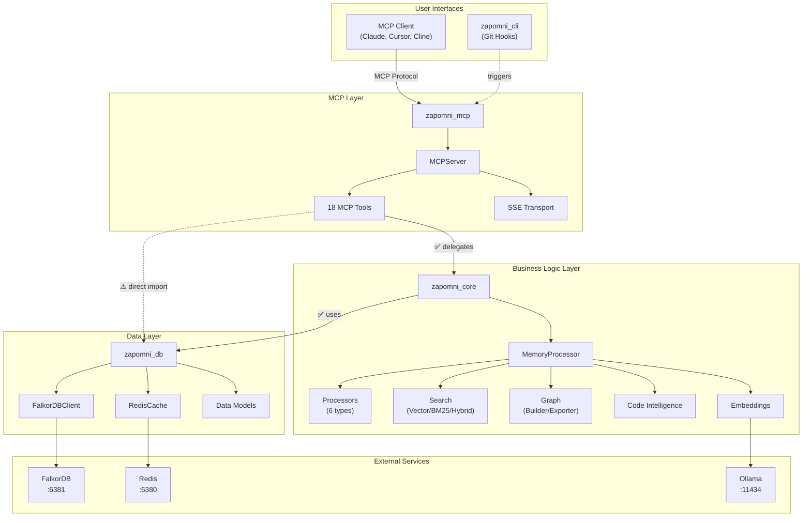
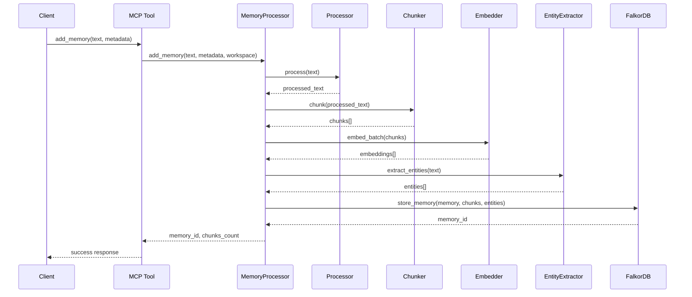
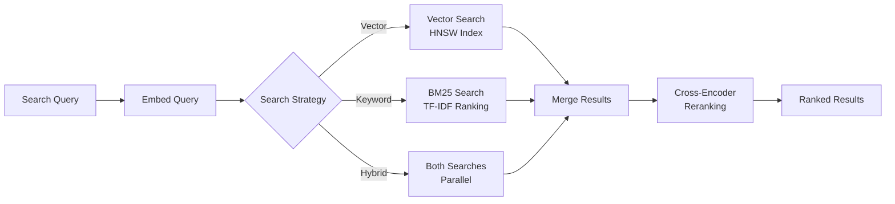

# Zapomni Architecture

## Overview

Zapomni is a local-first MCP (Model Context Protocol) memory server designed for AI agents. The architecture follows a clean layered approach with four distinct layers, each with specific responsibilities and clear boundaries.

**Design Philosophy:**
- **Local-first**: All data stored locally in FalkorDB and Redis
- **MCP Protocol**: Standard interface for AI agents (Claude, Cursor, Cline)
- **Async-first**: Built on asyncio for high concurrency
- **Dependency Injection**: Testable, modular components
- **Type-safe**: Full type hints throughout the codebase

**Key Components:**
- **Graph Database**: FalkorDB (Redis module) for vector search and knowledge graphs
- **Embeddings**: Ollama for local semantic embeddings
- **Processing**: Multiple processors for text, PDF, DOCX, HTML, Markdown, and code
- **Search**: Hybrid search combining vector similarity and BM25 keyword matching

## Architecture Layers

Zapomni consists of 4 distinct layers, from top to bottom:

```
┌─────────────────────────────────────────────────┐
│         MCP Layer (zapomni_mcp)                 │
│  - MCP Server (stdio + SSE transport)           │
│  - 18 MCP Tools                                 │
│  - Session Management                           │
└─────────────────────────────────────────────────┘
                      ↓
┌─────────────────────────────────────────────────┐
│      Business Logic Layer (zapomni_core)        │
│  - MemoryProcessor (orchestrator)               │
│  - Processors (6 types)                         │
│  - Search (Vector/BM25/Hybrid)                  │
│  - Graph Builder & Exporter                     │
│  - Code Intelligence (AST, call graphs)         │
│  - Embeddings & Chunking                        │
└─────────────────────────────────────────────────┘
                      ↓
┌─────────────────────────────────────────────────┐
│         Data Layer (zapomni_db)                 │
│  - FalkorDB Client (async with pooling)         │
│  - Redis Cache (semantic caching)               │
│  - Data Models                                  │
│  - Schema Manager (HNSW indexes)               │
└─────────────────────────────────────────────────┘
                      ↓
┌─────────────────────────────────────────────────┐
│        CLI Layer (zapomni_cli)                  │
│  - Git Hooks Installer                          │
│  - Command-line utilities                       │
└─────────────────────────────────────────────────┘
```

### 1. MCP Layer (zapomni_mcp/)

**Purpose**: Implements the MCP protocol and exposes tools to AI agents.

**Location**: `src/zapomni_mcp/` (~7,851 lines of code)

**Key Components:**

- **MCPServer** (`server.py`):
  - Implements MCP protocol with stdio and SSE transports
  - Tool registration and lifecycle management
  - Graceful shutdown handling

- **18 MCP Tools** (`tools/`):
  - Memory Operations: add_memory, search_memory, get_stats, delete_memory
  - Graph Operations: build_graph, get_related, graph_status, export_graph
  - Code Intelligence: index_codebase
  - System Management: clear_all, prune_memory, set_model
  - Workspace Management: create_workspace, list_workspaces, set_current_workspace, get_current_workspace, delete_workspace

- **SSE Transport** (`sse_transport.py`):
  - Server-Sent Events for web-based clients
  - CORS and DNS rebinding protection
  - Connection lifecycle management

- **Session Manager** (`session_manager.py`):
  - Manages SSE sessions
  - Workspace tracking per session
  - Heartbeat and timeout handling

**Design Patterns:**
- Each tool implements a standard interface: `name`, `description`, `input_schema`, `execute()`
- Tools delegate business logic to Core layer (MemoryProcessor)
- Pydantic models for request/response validation

**Dependencies:**
- ✅ Imports from Core layer (correct direction)
- ⚠️ Some direct imports from DB layer (minor layer violations for constants)

### 2. Business Logic Layer (zapomni_core/)

**Purpose**: Contains all business logic, processing pipelines, and algorithms.

**Location**: `src/zapomni_core/` (~16,695 lines of code, 59% of codebase)

**Key Components:**

#### MemoryProcessor (memory_processor.py)
Main orchestrator for the memory processing pipeline:

```python
text → process() → chunk → embed → extract entities → store → return memory_id
```

Operations:
- `add_memory()`: Process and store new memory
- `search_memory()`: Vector/BM25/hybrid search
- `delete_memory()`: Remove memory and cleanup
- `get_stats()`: Database statistics

#### Processors (processors/)
6 specialized processors with common interface:

| Processor | Handles | Key Features |
|-----------|---------|--------------|
| TextProcessor | Plain text | Default fallback |
| PDFProcessor | PDF files | PyMuPDF extraction |
| DOCXProcessor | Word documents | python-docx |
| HTMLProcessor | Web pages | Trafilatura extraction |
| MarkdownProcessor | Markdown | Preserves structure |
| CodeProcessor | Source code | Language detection |

**ProcessorFactory**: Auto-detection of content type and processor selection.

#### Search (search/)
Multiple search strategies:

- **VectorSearch**: Semantic similarity using HNSW index
- **BM25Search**: Keyword-based ranking
- **HybridSearch**: Combines vector + BM25 with tunable weights
- **CrossEncoderReranker**: Re-ranks results for better relevance

#### Embeddings (embeddings/)

- **OllamaEmbedder**: Local embeddings via Ollama
  - Default model: nomic-embed-text (768 dimensions)
  - Async batch processing
  - Error handling and retries

- **EmbeddingCache**: Redis-based caching
  - Reduces redundant API calls
  - Configurable TTL

#### Chunking (chunking/)

- **SemanticChunker**: Intelligent text splitting
  - Sentence-aware chunking
  - Configurable chunk size (default: 512 tokens)
  - Overlap for context preservation (default: 50 tokens)

#### Graph (graph/)

- **GraphBuilder**: Knowledge graph construction
  - Entity extraction (SpaCy + LLM refinement)
  - Relationship detection
  - Graph storage in FalkorDB

- **GraphExporter**: Export to multiple formats
  - GraphML (Gephi/yEd)
  - Cytoscape JSON (web visualization)
  - Neo4j Cypher (import to Neo4j)
  - Simple JSON

#### Code Intelligence (code/)
Advanced code analysis capabilities:

- **ASTCodeChunker**: AST-based code chunking
- **FunctionExtractor**: Extract function definitions
- **CallGraphAnalyzer**: Build call graphs
- **ClassHierarchyBuilder**: Analyze class relationships
- **RepositoryIndexer**: Full codebase indexing

#### Other Components

- **WorkspaceManager** (`workspace_manager.py`): Multi-tenancy support
- **RuntimeConfig** (`runtime_config.py`): Hot-reload of configuration
- **LoggingService** (`logging_service.py`): Structured logging with structlog

**Design Patterns:**
- Dependency Injection: All components receive dependencies in constructor
- Strategy Pattern: Multiple processors, search strategies
- Pipeline Pattern: Sequential processing stages
- Factory Pattern: ProcessorFactory for content detection

**Dependencies:**
- ✅ Imports from DB layer (correct direction)
- ✅ No imports from MCP layer (no circular dependencies)

### 3. Data Layer (zapomni_db/)

**Purpose**: Data access and persistence, isolated from business logic.

**Location**: `src/zapomni_db/` (~3,829 lines of code, 13% of codebase)

**Key Components:**

#### FalkorDBClient (falkordb_client.py)
Async graph database client with:
- **Connection Pooling**: BlockingConnectionPool for async operations
  - Configurable pool size (default: 20 connections)
  - Min/max pool size management
  - Health check interval (default: 30s)

- **Retry Logic**: Exponential backoff for transient errors
  - Max retries: 3 (configurable)
  - Initial delay: 0.1s, max delay: 2.0s

- **Operations**:
  - `add_memory()`: Store memory with chunks
  - `vector_search()`: HNSW vector search
  - `get_related()`: Graph traversal
  - `get_stats()`: Database metrics

#### SchemaManager (schema_manager.py)
Graph schema initialization:
- Node labels: Memory, Chunk, Entity, Code
- Relationships: HAS_CHUNK, MENTIONS, RELATED_TO
- HNSW vector index creation
- Index configuration (M=16, efConstruction=200)

#### CypherQueryBuilder (cypher_query_builder.py)
Safe Cypher query construction:
- Parameterized queries (prevents injection)
- Query templates
- Helper methods for common patterns

#### RedisCache (redis_cache/cache_client.py)
Semantic caching:
- Cache embeddings to avoid recomputation
- TTL-based expiration (default: 24 hours)
- LRU eviction policy
- Configurable max memory (default: 1GB)

#### Models (models.py)
Pydantic data models:
- **Memory**: Top-level memory object
- **Chunk**: Text chunks with embeddings
- **Entity**: Extracted entities
- **Relationship**: Entity relationships
- **Workspace**: Workspace metadata
- **SearchResult**: Search result format

**Design Patterns:**
- Repository Pattern: Encapsulates data access
- Connection Pooling: Efficient resource usage
- Async/Await: Non-blocking I/O

**Dependencies:**
- ✅ No imports from Core or MCP layers (fully isolated)
- External: FalkorDB, Redis, Pydantic

### 4. CLI Layer (zapomni_cli/)

**Purpose**: Command-line utilities for Zapomni operations.

**Location**: `src/zapomni_cli/` (~100 lines of code, <1% of codebase)

**Key Components:**

- **CLI Entry Point** (`__main__.py`): Argument parsing and command routing
- **Git Hooks Installer** (`install_hooks.py`): Installs Git hooks for automatic re-indexing
- **Hook Scripts** (`hooks/`): Shell scripts for post-commit, post-merge, post-checkout

**Usage:**
```bash
zapomni install-hooks [--repo-path PATH]
```

**Design Patterns:**
- Command Pattern: Each CLI command is isolated
- Template Method: Hook templates for different Git events

**Dependencies:**
- ✅ Uses only standard library (no dependencies on other layers)
- Completely isolated for portability

## Dependency Graph

### Layer Dependencies (Textual)

```
MCP Layer (zapomni_mcp)
  ├── imports Core ✅ (correct direction)
  │   └── MemoryProcessor, WorkspaceManager, RuntimeConfig, exceptions, config
  ├── imports DB ⚠️ (partial violations)
  │   └── FalkorDBClient (in __main__.py, prune_memory.py)
  │   └── DEFAULT_WORKSPACE_ID, Workspace, WorkspaceStats (model constants)
  └── imports external (mcp SDK, pydantic, structlog, starlette)

Core Layer (zapomni_core)
  ├── imports DB ✅ (correct direction)
  │   └── FalkorDBClient, Memory, Chunk, Entity, SearchResult
  ├── NOT imports MCP ✅
  └── imports external (pydantic, spacy, ollama, structlog)

DB Layer (zapomni_db)
  ├── NOT imports Core ✅
  ├── NOT imports MCP ✅
  └── imports external (falkordb, redis, pydantic)

CLI Layer (zapomni_cli)
  ├── NOT imports Core ✅
  ├── NOT imports MCP ✅
  ├── NOT imports DB ✅
  └── imports only stdlib (argparse, pathlib, shutil)
```

### Full System Diagram



## Component Details

### MemoryProcessor Pipeline

The MemoryProcessor orchestrates the complete memory processing pipeline:



### Search Flow



## Design Principles

### 1. Separation of Concerns

Each layer has a single responsibility:
- **MCP Layer**: Protocol handling and API exposure
- **Core Layer**: Business logic and algorithms
- **DB Layer**: Data persistence and retrieval
- **CLI Layer**: Command-line utilities

### 2. Dependency Injection

All major components accept dependencies in their constructors:

```python
# Good: Dependencies injected
class MemoryProcessor:
    def __init__(
        self,
        db_client: FalkorDBClient,
        chunker: SemanticChunker,
        embedder: OllamaEmbedder,
        entity_extractor: EntityExtractor,
        ...
    ):
        self.db_client = db_client
        # ...
```

Benefits:
- Easy testing with mocks
- Flexible configuration
- Clear dependencies

### 3. Async-First

All I/O operations use async/await:
- Database queries
- HTTP requests (Ollama API)
- File operations
- Concurrent task execution

Benefits:
- High concurrency (handle multiple MCP clients)
- Non-blocking operations
- Efficient resource usage

### 4. Type Safety

Full type hints throughout:
- Function signatures
- Pydantic models for validation
- Mypy strict mode enabled

Benefits:
- Catch errors at development time
- Better IDE support
- Self-documenting code

### 5. Configuration Management

Centralized configuration via Pydantic Settings:
- Environment variables
- `.env` file support
- Type validation
- Default values

See [CONFIGURATION.md](CONFIGURATION.md) for details.

## Data Flow Example: Adding a Memory

Complete flow from MCP client to database:

```
1. MCP Client sends add_memory request
   ↓
2. MCPServer routes to AddMemoryTool
   ↓
3. AddMemoryTool validates input (Pydantic)
   ↓
4. AddMemoryTool → MemoryProcessor.add_memory()
   ↓
5. MemoryProcessor pipeline:
   a. ProcessorFactory → TextProcessor.process()
   b. SemanticChunker.chunk() → chunks[]
   c. OllamaEmbedder.embed_batch() → embeddings[]
   d. EntityExtractor.extract() → entities[]
   ↓
6. MemoryProcessor → FalkorDBClient.add_memory()
   ↓
7. FalkorDB stores:
   - Memory node
   - Chunk nodes with embeddings
   - Entity nodes
   - Relationships (HAS_CHUNK, MENTIONS)
   ↓
8. Return memory_id up the stack
   ↓
9. AddMemoryTool formats MCP response
   ↓
10. MCPServer sends response to client
```

## Performance Considerations

### Connection Pooling

FalkorDB uses connection pooling for efficiency:
- Pool size: 20 connections (configurable)
- Reuses connections across requests
- Health checks every 30 seconds

### Caching

Multiple caching layers:
- **Redis Cache**: Embedding cache (optional)
- **In-memory**: BM25 index caching

### Async Concurrency

Concurrent operations:
- Batch embedding generation
- Parallel search strategies (hybrid search)
- Multiple MCP client sessions

### Indexing

Optimized database indexes:
- HNSW vector index (M=16, efConstruction=200)
- Property indexes on workspace_id
- Relationship indexes

## Error Handling

Structured exception hierarchy:

```
ZapomniError (base)
├── ValidationError
├── ProcessingError
├── EmbeddingError
├── SearchError
├── DatabaseError
│   ├── ConnectionError
│   ├── QueryError
│   └── TransactionError
└── WorkspaceError
```

Each layer catches and re-raises with context:
- MCP Layer: Formats errors for MCP protocol
- Core Layer: Adds business logic context
- DB Layer: Provides database error details

## Testing Strategy

Comprehensive test suite (2019 tests):

- **Unit Tests** (1864 tests, 92.3%):
  - Each component tested in isolation
  - Mock external dependencies
  - Fast execution (~50s for full suite)

- **Integration Tests** (155 tests, 7.7%):
  - Test layer interactions
  - Real database connections (test instances)
  - Workspace isolation

- **Coverage**: 74-89% across different layers
  - MCP Tools: 74%
  - Core Layer: 86-89%
  - DB Layer: 71%

See [DEVELOPMENT.md](DEVELOPMENT.md) for testing details.

## Known Architecture Issues

### Minor Layer Violations

**Issue**: MCP layer directly imports some DB layer components.

**Location**:
- `src/zapomni_mcp/__main__.py` - FalkorDBClient initialization
- `src/zapomni_mcp/tools/prune_memory.py` - Direct FalkorDB access
- Multiple files - DEFAULT_WORKSPACE_ID constant

**Severity**: LOW-MEDIUM

**Impact**: Tight coupling between MCP and DB layers for specific operations.

**Recommendation**:
1. Move prune logic to Core layer (create PruneService)
2. Re-export constants from Core layer
3. Keep __main__.py as-is (acceptable for entry point)

## Related Documentation

- **[API.md](API.md)**: Complete MCP tools reference
- **[CONFIGURATION.md](CONFIGURATION.md)**: All configuration options
- **[CLI.md](CLI.md)**: Command-line tools and Git hooks
- **[DEVELOPMENT.md](DEVELOPMENT.md)**: Development setup and testing

## Metrics

### Codebase Size

| Layer | Files | Lines of Code | Percentage |
|-------|-------|---------------|------------|
| Core Layer | 49 | ~16,695 | 59% |
| MCP Layer | 20 | ~7,851 | 28% |
| DB Layer | 8 | ~3,829 | 13% |
| CLI Layer | 3 | ~100 | <1% |
| **Total** | **80** | **~28,475** | **100%** |

### Architecture Quality

| Metric | Score | Assessment |
|--------|-------|------------|
| **Coupling** | Medium | Minor MCP→DB violations |
| **Cohesion** | High | Clear layer separation |
| **Extensibility** | Good | DI enables extensions |
| **Testability** | Good | 2019 tests, high coverage |
| **Documentation** | Good | Comprehensive docs |

## Changelog

- **2025-11-26**: Initial architecture documentation based on T0.2 audit
- Architecture matches README description (85% correspondence)
- 4 layers identified (3 declared + CLI layer)
