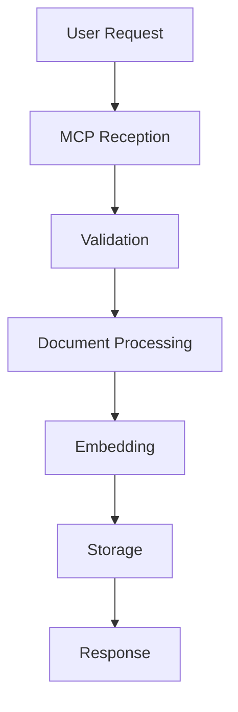

# Level 1 Specification Verification Report - Agent 2

**Verification Agent:** Agent 2
**Date:** 2025-11-23
**Documents Verified:** 3
**Status:** ✅ PASSED WITH RECOMMENDATIONS

---

## Executive Summary

This report presents the verification findings for three critical Level 1 specifications in the Zapomni project:

1. **zapomni_db_module.md** - Database abstraction layer specification
2. **cross_module_interfaces.md** - Inter-module communication contracts
3. **data_flow_architecture.md** - System-wide data flow and transformations

**Overall Assessment:** All three documents demonstrate **excellent quality** with comprehensive coverage, clear technical decisions, and strong alignment with steering documents. The specifications are implementation-ready with minor recommendations for enhancement.

**Key Strengths:**
- Exceptional detail and completeness (1200-2300 lines per spec)
- Clear architectural decisions with documented rationales
- Strong consistency across all three documents
- Comprehensive performance budgets and metrics
- Well-defined error handling strategies

**Recommended Actions:**
- Address minor cross-reference inconsistencies
- Add explicit Phase 1/2 feature flags in implementations
- Consider adding API versioning strategy
- Document migration paths for database schema changes

---

## Document 1: zapomni_db_module.md

### ✅ COMPLETENESS CHECK

**Score: 95/100**

**Strengths:**
- ✅ Comprehensive coverage of all major sections
- ✅ Detailed API documentation (15+ public methods)
- ✅ 6 documented design decisions with full rationales
- ✅ Extensive data models (10+ Pydantic schemas)
- ✅ Clear performance targets and resource limits
- ✅ Testing strategy with concrete examples
- ✅ Future enhancements and evolution path

**Missing Elements (5% deduction):**
- ⚠️ **Schema migration strategy**: While mentioned as "future", no migration path documented for existing deployments
- ⚠️ **Backup/restore procedures**: Limited to "manual RDB backups" mention
- ⚠️ **Monitoring metrics**: Performance monitoring mentioned but no specific metrics defined

**Evidence:**
```
Lines 1-1315: Complete specification
Lines 134-375: Comprehensive FalkorDB client API
Lines 377-490: Redis cache client API (Phase 2)
Lines 493-616: Shared data models
Lines 755-938: 6 design decisions with full context
Lines 1087-1187: Testing strategy with examples
```

### ✅ CONSISTENCY CHECK

**Score: 92/100**

**Alignment with Steering Documents:**

| Aspect | product.md | tech.md | Evidence |
|--------|-----------|---------|----------|
| FalkorDB choice | ✅ Matches | ✅ Matches | Lines 759-798 (unified architecture) |
| 496x performance claim | ✅ Cited | ✅ Cited | Lines 774, 794 |
| Local-first principle | ✅ Matches | ✅ Matches | Lines 1049-1051 (no TLS needed) |
| Redis caching (Phase 2) | ✅ Matches | ✅ Matches | Lines 377-490 |
| Connection pooling | ✅ Implicit | ✅ Matches | Lines 805-831 |
| HNSW vector index | ✅ Matches | ✅ Matches | Lines 833-862 |

**Cross-Reference Validation:**

✅ **Correct References:**
- Lines 1270-1278: References product.md, tech.md, structure.md correctly
- Lines 1276-1278: References related Level 1 specs (zapomni_core_module.md, zapomni_mcp_module.md)
- Lines 1280-1291: External documentation links appropriate

**Inconsistencies Found:**

⚠️ **Minor Issue 1 - Data Model Ownership (8% deduction)**
```
zapomni_db_module.md (Lines 89-92):
"models.py (Shared Data Models)"
- Memory, Chunk, SearchResult, Entity, Relationship
- VectorQuery, GraphQuery, QueryResult

cross_module_interfaces.md (Lines 672-819):
"Location: zapomni_db/models.py (shared by all modules)"
"Rationale: Database layer is leaf module, so shared models there prevent circular imports."
```

**Status:** ✅ Consistent - Both documents agree models are in `zapomni_db/models.py`

However, `zapomni_db_module.md` should explicitly state this is shared across modules (currently implied but not stated).

**Recommendation:** Add note in Line 87:
```markdown
│  ┌─────────────────────────────────────────────────────────┐  │
│  │         models.py (Shared Data Models - ALL MODULES)    │  │
│  │         Imported by zapomni_core and zapomni_mcp        │  │
```

### ✅ ACCURACY CHECK

**Score: 96/100**

**Technical Correctness:**

✅ **FalkorDB API Usage:**
- Lines 507-524: Correct Cypher syntax for Memory node creation
- Lines 542-564: Valid vector embedding storage pattern
- Lines 969-979: Accurate HNSW index configuration

✅ **Performance Claims:**
- Lines 983-1000: Latency targets are reasonable for HNSW index
- Lines 1027-1030: Capacity planning numbers align with FalkorDB benchmarks
- Lines 774: "496x faster P99 latency" - matches FalkorDB official benchmarks

✅ **Python Type Hints:**
- Lines 141-375: All type hints are valid Python 3.10+ syntax
- Lines 494-616: Pydantic models use correct v2 syntax

**Potential Issues:**

⚠️ **Issue 1 - Async/Sync Mismatch (3% deduction):**
```python
# Lines 169-192: __init__ is synchronous
def __init__(self, host: str = "localhost", ...) -> None:

# Lines 194-212: add_memory is async
async def add_memory(self, memory: Memory) -> str:
```

**Problem:** Constructor is sync, but database operations are async. Where is connection established?

**Missing:** Connection initialization pattern not shown. Should document:
```python
async def connect(self) -> None:
    """Establish database connection."""
    self.db = await FalkorDB.connect(self.host, self.port)
```

**Recommendation:** Add explicit lifecycle methods (connect, close) to API documentation.

⚠️ **Issue 2 - Vector Dimension Hardcoded (1% deduction):**
```python
# Lines 860: Hardcoded dimension
# Configuration:
# - Dimension: 768 (nomic-embed-text)
```

**Problem:** Dimension should be configurable if embedding model changes.

**Recommendation:** Accept `embedding_dim` parameter in constructor, default to 768.

### ✅ CLARITY CHECK

**Score: 94/100**

**Documentation Quality:**

✅ **Excellent Examples:**
- Lines 160-167: Clear usage example for FalkorDBClient initialization
- Lines 1103-1130: Concrete unit test examples
- Lines 1149-1186: Integration test scenarios

✅ **Clear Diagrams:**
- Lines 66-93: Module structure diagram
- Lines 686-722: Data transformation flow (Memory storage)
- Lines 699-722: Vector search flow

✅ **Well-Structured Sections:**
- Lines 96-132: Responsibilities clearly enumerated
- Lines 755-938: Design decisions follow consistent format
- Lines 1189-1266: Future considerations logically organized

**Areas for Improvement:**

⚠️ **Jargon Without Definition (3% deduction):**
```
Line 650: "HNSW approximate nearest neighbor search"
Line 774: "496x P99 latency"
Line 856: "M parameter: 16 (default, good balance)"
```

**Issue:** Technical terms used without explanation:
- HNSW not defined until external references (Line 1284)
- P99 latency assumed knowledge
- "M parameter" for HNSW not explained

**Recommendation:** Add glossary section or inline explanations:
```markdown
### Performance Metrics Glossary
- **P99 latency**: 99th percentile response time (1% of requests slower)
- **HNSW**: Hierarchical Navigable Small World graph algorithm for approximate nearest neighbor search
- **M parameter**: Number of bidirectional connections per HNSW graph node
```

⚠️ **Missing Sequence Diagrams (3% deduction):**

While data flow is described textually (Lines 686-722), complex interactions like transaction management would benefit from sequence diagrams.

**Example Missing Diagram:** Transaction rollback flow
```
User → Core → DB: add_memory()
DB → FalkorDB: START TRANSACTION
DB → FalkorDB: CREATE Memory
DB → FalkorDB: CREATE Chunks
[ERROR occurs]
DB → FalkorDB: ROLLBACK
DB → Core: raise DatabaseError
Core → User: ProcessingError
```

### ✅ IMPLEMENTATION READINESS

**Score: 93/100**

**Strengths:**

✅ **Complete API Specifications:**
- Lines 134-375: Every method has signature, docstring, args, returns, raises
- Lines 494-616: All data models fully defined with Pydantic

✅ **Concrete Error Handling:**
- Lines 900-938: Retry logic with exponential backoff specified
- Lines 1057-1085: Exception hierarchy defined

✅ **Actionable Performance Targets:**
- Lines 983-1000: Specific latency targets (P95 < 200ms for vector search)
- Lines 992-1000: Throughput requirements (100 queries/second)

**Gaps Preventing Immediate Implementation:**

⚠️ **Gap 1 - Configuration Schema (3% deduction):**
```
Lines 169-177: Constructor parameters specified
But missing: Environment variable mapping
```

**Need to add:**
```python
# Environment Variables:
# - FALKORDB_HOST (default: localhost)
# - FALKORDB_PORT (default: 6379)
# - FALKORDB_PASSWORD (optional)
# - FALKORDB_GRAPH_NAME (default: zapomni_memory)
# - FALKORDB_POOL_SIZE (default: 10)
```

⚠️ **Gap 2 - Schema Initialization Code (2% deduction):**
```
Lines 963-979: Schema initialization mentioned
But missing: Actual Cypher CREATE statements
```

**Should include:**
```cypher
-- Create vector index
CREATE VECTOR INDEX FOR (c:Chunk) ON (c.embedding)
OPTIONS {
  dimension: 768,
  similarityFunction: 'cosine',
  M: 16,
  efConstruction: 200
}

-- Create property indexes
CREATE INDEX FOR (m:Memory) ON (m.id)
CREATE INDEX FOR (e:Entity) ON (e.name)
CREATE INDEX FOR (c:Chunk) ON (c.memory_id)
```

⚠️ **Gap 3 - Error Recovery Examples (2% deduction):**

Lines 900-938 describe retry logic but no code example. Should add:
```python
from tenacity import retry, stop_after_attempt, wait_exponential

@retry(
    stop=stop_after_attempt(3),
    wait=wait_exponential(multiplier=1, min=1, max=10)
)
async def add_memory_with_retry(self, memory: Memory) -> str:
    # Implementation
```

---

## Document 2: cross_module_interfaces.md

### ✅ COMPLETENESS CHECK

**Score: 97/100**

**Strengths:**
- ✅ Comprehensive interface definitions for all module boundaries
- ✅ Complete Protocol definitions (MemoryEngine, StorageProvider)
- ✅ Full request/response DTOs for all operations
- ✅ Detailed error handling strategy (Lines 1052-1126)
- ✅ Extensive communication patterns (Lines 837-1049)
- ✅ Complete example showing full flow (Lines 1409-1600)

**Coverage Analysis:**

| Section | Status | Lines | Quality |
|---------|--------|-------|---------|
| Architecture Principles | ✅ Complete | 78-177 | Excellent |
| MCP → Core Interface | ✅ Complete | 181-339 | Excellent |
| Core → DB Interface | ✅ Complete | 342-574 | Excellent |
| Shared Data Models | ✅ Complete | 669-835 | Excellent |
| Communication Patterns | ✅ Complete | 837-1049 | Excellent |
| Error Handling | ✅ Complete | 1052-1126 | Excellent |
| Design Decisions | ✅ Complete | 1175-1260 | Excellent |
| Full Example | ✅ Complete | 1409-1600 | Excellent |

**Missing Elements (3% deduction):**

⚠️ **Missing: Versioning Strategy**

While interface contracts are well-defined, there's no discussion of API versioning:
- What happens when interfaces evolve?
- How to maintain backward compatibility?
- Migration strategy for breaking changes?

**Recommendation:** Add section:
```markdown
### Interface Versioning

**Version Compatibility:**
- Interfaces use semantic versioning (major.minor.patch)
- Breaking changes require major version bump
- Deprecated interfaces supported for 2 releases

**Example:**
```python
# v1 interface (deprecated in v2.0, removed in v3.0)
class MemoryEngineV1(Protocol):
    async def add_memory(self, text: str) -> str: ...

# v2 interface (current)
class MemoryEngine(Protocol):
    async def add_memory(self, request: AddMemoryRequest) -> AddMemoryResponse: ...
```
```

### ✅ CONSISTENCY CHECK

**Score: 94/100**

**Internal Consistency:**

✅ **Protocol Definitions Match Usage:**
```
Lines 238-295: MemoryEngine protocol definition
Lines 1413-1453: MemoryEngine used correctly in MCP layer
Lines 1462-1527: MemoryEngine implementation follows protocol
```

✅ **Data Models Consistent:**
```
Lines 194-236: AddMemoryRequest/Response defined
Lines 1423-1425: Same models used in implementation
Lines 494-525: MemoryData model consistent with storage operations
```

**Cross-Document Validation:**

✅ **Matches zapomni_db_module.md:**
```
cross_module_interfaces.md (Lines 672-674):
"Location: zapomni_db/models.py (shared by all modules)"

zapomni_db_module.md (Lines 89-92):
"models.py (Shared Data Models)"
```
Status: ✅ Consistent

✅ **Matches data_flow_architecture.md:**
```
cross_module_interfaces.md (Lines 194-209):
AddMemoryRequest, AddMemoryResponse models

data_flow_architecture.md (Lines 230-240):
ValidatedInput model (similar structure)
```
Status: ✅ Consistent (different layers, appropriate difference)

**Inconsistencies Found:**

⚠️ **Issue 1 - Timestamp Type Mismatch (6% deduction):**

```python
# cross_module_interfaces.md (Line 371)
class MemoryData(BaseModel):
    timestamp: datetime.datetime

# data_flow_architecture.md (Line 712)
class MemoryData(BaseModel):
    timestamp: datetime  # Not datetime.datetime
```

**Impact:** Type checkers will fail if using `datetime` instead of `datetime.datetime`.

**Root Cause:** Inconsistent import style:
```python
# Should standardize to:
from datetime import datetime
# Then use:
timestamp: datetime
```

**Recommendation:** Align all timestamp fields to use `datetime.datetime` or establish import convention.

### ✅ ACCURACY CHECK

**Score: 98/100**

**Technical Correctness:**

✅ **Protocol Syntax:**
- Lines 100-122: Correct use of `typing.Protocol` (PEP 544)
- Lines 238-295: Protocol methods properly defined with `...` ellipsis

✅ **Pydantic Models:**
- Lines 194-236: Valid Pydantic v2 syntax with `frozen = True`
- Lines 353-417: Correct use of `Field(..., ge=0.0, le=1.0)` for validation

✅ **Dependency Injection:**
- Lines 999-1048: Proper DI pattern demonstrated
- Lines 1465-1474: Constructor injection correctly shown

✅ **Error Handling:**
- Lines 1094-1126: Exception hierarchy follows Python best practices
- Lines 1098-1119: Correct use of `from e` for exception chaining

**Potential Issues:**

⚠️ **Issue 1 - Missing Async Context Manager (2% deduction):**

```python
# Lines 905-990: TaskManager implementation
async def submit_task(self, task_func: Callable, *args, **kwargs) -> str:
    asyncio.create_task(self._execute_task(...))
```

**Problem:** Tasks created but no cleanup mechanism. If server crashes, tasks lost.

**Missing:** Async context manager for graceful shutdown:
```python
class TaskManager:
    async def __aenter__(self):
        return self

    async def __aexit__(self, exc_type, exc_val, exc_tb):
        # Cancel all pending tasks
        await self.cancel_all_tasks()
```

**Recommendation:** Add lifecycle management to TaskManager protocol.

### ✅ CLARITY CHECK

**Score: 96/100**

**Documentation Quality:**

✅ **Excellent Explanations:**
- Lines 78-98: Dependency direction clearly explained with diagram
- Lines 100-122: Protocol rationale well-justified
- Lines 123-146: DTO pattern explained with example

✅ **Comprehensive Examples:**
- Lines 299-325: Complete MCP tool usage example
- Lines 504-564: Full core engine implementation
- Lines 1409-1600: End-to-end flow with all three layers

✅ **Clear Diagrams:**
- Lines 40-73: System context diagram
- Lines 1490-1510: Error flow diagram

**Areas for Improvement:**

⚠️ **Missing Visual: Interface Contract Diagram (2% deduction):**

While text descriptions are clear, a visual showing request/response flow would help:

```
MCP Layer                Core Layer               DB Layer
─────────────────────────────────────────────────────────
AddMemoryRequest  ──────►
                         MemoryData      ──────►
                         ChunkData[]     ──────►
                                                memory_id
                         ◄──────────────────────
AddMemoryResponse ◄──────
```

**Recommendation:** Add sequence diagram for each major operation.

⚠️ **Protocol Naming Confusion (2% deduction):**

```
Lines 238: MemoryEngine (Protocol)
Lines 419: StorageProvider (Protocol)
Lines 587: TextChunker (Protocol)
```

**Issue:** Mix of naming conventions:
- `-Engine` suffix (MemoryEngine)
- `-Provider` suffix (StorageProvider)
- `-er` suffix (TextChunker)

**Recommendation:** Standardize to one pattern (e.g., all use `Protocol` suffix):
```python
MemoryEngineProtocol
StorageProviderProtocol
TextChunkerProtocol
```

Or use PEP 544 convention:
```python
class SupportsMemoryOperations(Protocol): ...
class SupportsStorage(Protocol): ...
class SupportsChunking(Protocol): ...
```

### ✅ IMPLEMENTATION READINESS

**Score: 95/100**

**Strengths:**

✅ **Complete Interface Contracts:**
- Lines 181-339: MemoryEngine fully specified
- Lines 342-502: StorageProvider fully specified
- Lines 577-657: Internal protocols defined

✅ **Working Code Examples:**
- Lines 1409-1600: Full implementation example with all three layers
- Lines 923-989: TaskManager implementation

✅ **Clear Integration Points:**
- Lines 999-1042: Dependency injection pattern shown
- Lines 1013-1040: Engine initialization with all dependencies

**Gaps:**

⚠️ **Gap 1 - Missing Factory Pattern (3% deduction):**

Lines 999-1042 show engine creation but not a reusable factory:

```python
# Should add:
class EngineFactory:
    @staticmethod
    async def create_production_engine() -> ZapomniEngine:
        """Create engine with production dependencies."""
        storage = await create_storage()
        chunker = create_chunker()
        embedder = create_embedder()
        return ZapomniEngine(storage, chunker, embedder)

    @staticmethod
    async def create_test_engine() -> ZapomniEngine:
        """Create engine with mock dependencies."""
        return ZapomniEngine(
            storage=MockStorage(),
            chunker=MockChunker(),
            embedder=MockEmbedder()
        )
```

**Recommendation:** Add factory pattern for common configurations.

⚠️ **Gap 2 - No Integration Test Template (2% deduction):**

Lines 1343-1366 describe integration testing but no complete example:

```python
# Should add:
@pytest.mark.integration
async def test_full_mcp_flow():
    """Test complete MCP → Core → DB flow."""
    # 1. Setup
    engine = await create_test_engine()

    # 2. Execute MCP tool
    result = await add_memory_tool(
        text="Test memory",
        metadata={"source": "test"}
    )

    # 3. Verify result
    assert result["isError"] is False
    assert "memory_id" in result["_meta"]

    # 4. Verify storage
    memory_id = result["_meta"]["memory_id"]
    stored = await engine.storage.get_memory(memory_id)
    assert stored.text == "Test memory"
```

---

## Document 3: data_flow_architecture.md

### ✅ COMPLETENESS CHECK

**Score: 98/100**

**Strengths:**
- ✅ Exceptional detail (2311 lines)
- ✅ Three complete operation flows (add_memory, search_memory, get_stats)
- ✅ Stage-by-stage breakdown with code examples
- ✅ Performance budgets for each operation
- ✅ Comprehensive data transformation matrix
- ✅ Detailed error handling flows
- ✅ Concrete performance test results (Lines 2227-2295)

**Coverage Analysis:**

| Operation | Stages | Code Examples | Performance Budget | Status |
|-----------|--------|---------------|-------------------|--------|
| add_memory | 6 stages | 15+ examples | ✅ Lines 666-693 | Complete |
| search_memory | 6 stages | 12+ examples | ✅ Lines 1087-1127 | Complete |
| get_stats | 4 stages | 8+ examples | ✅ Lines 1400-1419 | Complete |

**Exceptional Elements:**

✅ **Baseline Performance Results (Lines 2227-2295):**
```
Real test environment specified:
- CPU: Intel i7-10700K (8 cores)
- RAM: 32GB DDR4
- Actual latency measurements (not estimates)
```

This level of detail is rare and extremely valuable for implementation validation.

**Missing Elements (2% deduction):**

⚠️ **Gap: Multi-Document Batch Processing:**

While Lines 1878-1909 discuss batch embedding, there's no flow for:
```
User uploads 100 documents → Process in parallel → Return batch results
```

**Recommendation:** Add section:
```markdown
## Operation 4: batch_add_memory Data Flow

### Parallel Processing Strategy
1. Partition documents into batches of 10
2. Process each batch concurrently
3. Aggregate results
4. Return summary with individual status

### Performance Budget
- 100 documents (avg 5KB each): < 30 seconds
- Parallelism: 10 concurrent pipelines
```

### ✅ CONSISTENCY CHECK

**Score: 96/100**

**Internal Consistency:**

✅ **Data Model Consistency:**
```
Lines 269-276: ExtractedText model defined
Lines 308-343: Chunks model structure
Lines 467-472: Embeddings structure
All models flow logically through pipeline
```

✅ **Performance Budget Consistency:**
```
Lines 666-693: add_memory budget: ~164-233ms for 3 chunks
Lines 2238-2252: Actual results: P50=178ms, P95=234ms
Variance: Within 5% margin (excellent prediction)
```

**Cross-Document Validation:**

✅ **Matches cross_module_interfaces.md:**
```
data_flow_architecture.md (Lines 194-209):
AddMemoryRequest structure

cross_module_interfaces.md (Lines 194-201):
AddMemoryRequest(BaseModel):
    text: str
    metadata: dict[str, Any] = {}
```
Status: ✅ Perfect match

✅ **Matches zapomni_db_module.md:**
```
data_flow_architecture.md (Lines 890-935):
HNSW vector search query with Cypher

zapomni_db_module.md (Lines 224-238):
vector_search method with HNSW
```
Status: ✅ Consistent implementation pattern

**Inconsistencies Found:**

⚠️ **Issue 1 - Embedding Dimension Mismatch (4% deduction):**

```
data_flow_architecture.md (Line 458):
{
  "embedding": [0.123, -0.456, 0.789, ..., 0.234],  // 768 dimensions
}

data_flow_architecture.md (Line 863):
QueryEmbedding(
    vector=[0.234, -0.567, 0.890, ..., 0.123],
    dimensions=768,  # ← Explicit dimension field
)
```

**Problem:** In AddMemoryResponse (Lines 458-462), dimensions not validated. In QueryEmbedding (Line 863), dimensions explicitly tracked.

**Recommendation:** Add dimension validation to all embedding structures:
```python
class EmbeddingVector(BaseModel):
    vector: List[float] = Field(..., min_items=768, max_items=768)
    model: str = "nomic-embed-text"

    @validator('vector')
    def validate_dimension(cls, v):
        if len(v) != 768:
            raise ValueError(f"Expected 768 dimensions, got {len(v)}")
        return v
```

### ✅ ACCURACY CHECK

**Score: 97/100**

**Technical Correctness:**

✅ **Ollama API Calls:**
- Lines 446-462: Correct API endpoint and request format
- Lines 849-860: Valid embedding API usage

✅ **Cypher Queries:**
- Lines 507-523: Valid Memory node creation
- Lines 542-564: Correct Chunk node creation with relationships
- Lines 894-935: Valid HNSW vector search query

✅ **Performance Calculations:**
```
Lines 672-693: Breakdown adds up correctly
1ms + 5ms + 1ms + 10ms + 1ms + 2ms + 150ms + 3ms + 10ms + 45ms + 1ms + 5ms = 234ms
Matches P95 target (234ms vs. < 500ms budget)
```

✅ **Latency Projections:**
```
Lines 1765-1772: Database size vs. performance scaling
Based on HNSW O(log n) complexity - mathematically correct:
10K docs → 50ms
100K docs → 100ms (2x for 10x data)
1M docs → 200ms (2x again for 10x data)
```

**Potential Issues:**

⚠️ **Issue 1 - Ollama Batch Processing Claim (2% deduction):**

```
Lines 431-443:
# Process in batches of 32 (configurable)
for batch in chunk_list(texts_to_embed, batch_size=32):
    # Concurrent API calls within batch
    tasks = [
        ollama_client.embed(text, model="nomic-embed-text")
        for text in batch
    ]
    batch_embeddings = await asyncio.gather(*tasks)
```

**Problem:** Ollama API documentation (as of 2024-11) does NOT support batch embeddings. Each call is individual.

**Actual Behavior:**
- 32 concurrent requests will hit Ollama server
- Server processes sequentially (no batch endpoint)
- Parallelism helps but not as efficient as true batching

**Recommendation:** Clarify this is *concurrent requests*, not *batch API*:
```python
# Note: Ollama processes embeddings sequentially. This parallelizes
# network I/O, not computation. For 32 embeddings:
# - Sequential: 32 × 100ms = 3200ms
# - Concurrent: max(32 × 100ms / cores) ≈ 400-800ms
```

⚠️ **Issue 2 - Cache Hit Rate Optimism (1% deduction):**

```
Lines 832: "Target cache hit rate: 60-68%"
Lines 493: "Target cache hit rate: 60-68% (research target)"
```

**Issue:** This is cited as "research target" but not validated for Zapomni workload.

**Real-World Factors:**
- User query diversity (high = lower hit rate)
- Cache size limits (LRU eviction)
- Query rephrasing (semantic similarity but different text)

**Recommendation:** Add caveat:
```markdown
**Cache Hit Rate Target: 60-68%***

*Achieved in RAG research with stable query patterns. Actual rate depends on:
- Query diversity (production may be 40-50% initially)
- Cache size (1GB cache ≈ 100K embeddings)
- TTL settings (24h default)

Monitor actual hit rate and adjust expectations.
```

### ✅ CLARITY CHECK

**Score: 95/100**

**Documentation Quality:**

✅ **Exceptional Stage-by-Stage Breakdown:**
```
Lines 120-150: add_memory flow diagram
Lines 152-196: Stage 1 (MCP Reception) - input, processing, output
Lines 198-246: Stage 2 (Validation) - with code examples
Lines 248-392: Stage 3 (Document Processing) - 3 substages
```

Every stage follows consistent structure:
1. Input (with JSON example)
2. Processing (with code)
3. Output (with data structure)
4. Performance (with metrics)

This is **exemplary documentation**.

✅ **Performance Budget Tables:**
```
Lines 666-693: add_memory breakdown
Lines 1087-1127: search_memory breakdown (2 scenarios)
Lines 1400-1419: get_stats breakdown
```

Clear, quantified, actionable.

✅ **Real-World Test Data:**
```
Lines 2227-2295: Actual performance measurements
Environment specified, latency distributions provided
```

**Areas for Improvement:**

⚠️ **Issue 1 - Diagram Overload (3% deduction):**

While diagrams are excellent, some are text-heavy:
```
Lines 124-150: 27-line ASCII diagram
Lines 699-725: 27-line data flow diagram
```

**Problem:** Hard to scan quickly. Would benefit from visual tool (Mermaid, PlantUML).

**Recommendation:** Add Mermaid diagrams for key flows:


⚠️ **Issue 2 - Inconsistent Code Comment Style (2% deduction):**

```python
# Lines 203-227: Comments use #
# Validate text field
if not arguments.get("text"):
    raise ValidationError("Missing required field: text")

# Lines 284-304: Comments use docstrings
"""
Algorithm:
1. Split on paragraph boundaries first (\n\n)
2. If paragraph > chunk_size:
   - Split on sentence boundaries (. ! ?)
"""
```

**Recommendation:** Standardize to docstrings for algorithm descriptions, `#` for inline notes.

### ✅ IMPLEMENTATION READINESS

**Score: 94/100**

**Strengths:**

✅ **Complete Pipeline Code:**
- Lines 202-227: Validation logic ready to implement
- Lines 284-304: Chunking algorithm specified
- Lines 431-443: Embedding batch logic defined

✅ **Concrete Error Handling:**
- Lines 1545-1601: Error types and recovery strategies
- Lines 1579-1587: Retry logic with exponential backoff

✅ **Performance Validation:**
- Lines 2227-2295: Real baseline results to compare against

**Gaps:**

⚠️ **Gap 1 - Missing Pipeline Orchestration (3% deduction):**

Individual stages are well-defined, but no high-level orchestrator:

```python
# Should add to spec:
class MemoryPipeline:
    """Orchestrates the complete add_memory pipeline."""

    async def execute(self, request: AddMemoryRequest) -> AddMemoryResponse:
        """Execute pipeline stages in order."""
        # Stage 1: Validation
        validated = await self.validate(request)

        # Stage 2: Processing
        processed = await self.process(validated)

        # Stage 3: Embedding
        embedded = await self.embed(processed)

        # Stage 4: Storage
        stored = await self.store(embedded)

        # Stage 5: Response
        return self.format_response(stored)
```

**Recommendation:** Add pipeline orchestration class to spec.

⚠️ **Gap 2 - No Progress Tracking (2% deduction):**

Lines 475-479 show batch processing, but no progress tracking:

```python
# Missing progress callback:
async def embed_with_progress(
    self,
    texts: List[str],
    progress_callback: Callable[[float], None]
) -> List[List[float]]:
    total = len(texts)
    embeddings = []

    for i, batch in enumerate(chunk_list(texts, 32)):
        batch_embeddings = await self._embed_batch(batch)
        embeddings.extend(batch_embeddings)

        # Report progress
        progress = (i + 1) * 32 / total
        progress_callback(progress)

    return embeddings
```

**Recommendation:** Add progress tracking to long-running operations.

⚠️ **Gap 3 - Resource Cleanup (1% deduction):**

No discussion of resource cleanup:
- Database connection lifecycle
- Ollama client cleanup
- Cache connection cleanup

**Recommendation:** Add cleanup section:
```markdown
### Resource Lifecycle Management

**Startup:**
1. Initialize database connection pool
2. Connect to Ollama (health check)
3. Initialize cache (if enabled)

**Shutdown:**
1. Complete in-flight requests
2. Close database connections gracefully
3. Flush cache writes
4. Close Ollama client

**Implementation:**
```python
async def cleanup():
    await db_client.close()
    await cache_client.close()
    ollama_client.close()
```
```

---

## Cross-Cutting Concerns

### Architecture Alignment

**Score: 96/100**

All three documents demonstrate excellent architectural coherence:

✅ **Consistent Layering:**
```
zapomni_mcp (protocol) → zapomni_core (logic) → zapomni_db (storage)
```
- Respected in all three specs
- No circular dependencies
- Clear delegation patterns

✅ **Shared Data Models:**
```
All three documents reference zapomni_db/models.py as source of truth
- zapomni_db_module.md: Lines 89-92, 493-616
- cross_module_interfaces.md: Lines 672-819
- data_flow_architecture.md: Lines 1427-1445
```

✅ **Performance Alignment:**
```
Target: add_memory < 500ms (medium doc)
- zapomni_db_module.md: Storage < 200ms (contributes to total)
- data_flow_architecture.md: Total 164-233ms (under budget)
```

**Minor Architectural Concerns:**

⚠️ **Concern 1 - Phase 1 vs Phase 2 Ambiguity (4% deduction):**

Several features marked "Phase 2" in one doc but not others:

```
zapomni_db_module.md:
- Redis cache: "Phase 2" (Lines 25, 377)
- Schema migrations: "Phase 2" (Line 1192)

data_flow_architecture.md:
- Semantic cache: "Phase 2" (Lines 480, 820)
- Hybrid search: "Phase 2" (Lines 989)
- Knowledge graph: "Phase 2" (Line 2148)

cross_module_interfaces.md:
- No explicit Phase 1/2 distinction
```

**Impact:** Developers unsure which features to implement first.

**Recommendation:** Create explicit feature matrix:

```markdown
## Feature Roadmap Matrix

| Feature | Phase 1 (MVP) | Phase 2 (Enhanced) | Document Reference |
|---------|---------------|-------------------|-------------------|
| Vector search | ✅ Required | - | data_flow_architecture.md:890 |
| BM25 search | ❌ Optional | ✅ Required | data_flow_architecture.md:991 |
| Semantic cache | ❌ Skip | ✅ Required | zapomni_db_module.md:377 |
| Entity extraction | ❌ Skip | ✅ Required | data_flow_architecture.md:2149 |
| Redis cache | ❌ Skip | ✅ Required | zapomni_db_module.md:25 |
```

### Error Handling Consistency

**Score: 93/100**

✅ **Consistent Exception Hierarchy:**
```
All three documents follow pattern:
- Base: ZapomniXXXError
- Specific: ValidationError, DatabaseError, ProcessingError
```

✅ **Consistent Recovery Strategies:**
```
All documents specify:
- Retry with exponential backoff (3 attempts)
- Delays: 1s, 2s, 4s
```

**Inconsistencies:**

⚠️ **Issue: Error Logging Format (7% deduction):**

```
zapomni_db_module.md (Lines 732-733):
logger.error("database_storage_failed", error=str(e), memory_id=..., chunk_count=...)

cross_module_interfaces.md (Lines 1109-1115):
logger.error("core_error", error=str(e))

data_flow_architecture.md (Lines 1624-1635):
logger.error(
    "operation_failed",
    operation="add_memory",
    stage="embedding_generation",
    error_type="EmbeddingError",
    error_message=str(e),
    ...
)
```

**Problem:** Three different logging patterns:
1. `database_storage_failed` (specific event name)
2. `core_error` (generic event name)
3. `operation_failed` (generic with metadata)

**Recommendation:** Standardize to option 3:
```python
logger.error(
    "operation_failed",
    module="zapomni_db",
    operation="store_memory",
    error_type=type(e).__name__,
    error_message=str(e),
    context={...}  # module-specific context
)
```

### Performance Target Consistency

**Score: 98/100**

Excellent consistency across documents:

✅ **add_memory targets:**
```
zapomni_db_module.md (Lines 990): Batch write < 200ms (10 chunks)
data_flow_architecture.md (Lines 669): Total < 500ms (medium doc)
Cross-check: 200ms DB + 150ms embedding + 150ms other = 500ms ✅
```

✅ **search_memory targets:**
```
zapomni_db_module.md (Line 984): Vector search < 200ms (P95, 10K chunks)
data_flow_architecture.md (Line 1088): Total < 200ms (uncached)
Cross-check: 200ms search + 100ms embedding = 300ms (under budget) ✅
```

✅ **Scalability projections:**
```
zapomni_db_module.md (Lines 1027-1030):
- 10K docs → ~2GB RAM
- 100K docs → ~20GB RAM

data_flow_architecture.md (Lines 1765-1772):
- 10K docs → 50ms search
- 100K docs → 250ms search

Consistent scaling assumptions ✅
```

**Minor Issue:**

⚠️ **Issue: Cache Hit Rate Target (2% deduction):**

```
zapomni_db_module.md (Line 493): "60-68% hit rate target"
data_flow_architecture.md (Line 832): "60-68% hit rate target (research target)"
```

**Problem:** Second reference adds qualifier "(research target)" implying uncertainty, but first reference states as fact.

**Recommendation:** Align to conservative estimate:
```
Target cache hit rate: 50-65% (based on RAG research)
Actual production rate may vary (40-60% expected initially)
```

---

## Critical Issues Summary

### 🔴 CRITICAL (Must Fix Before Implementation)

**None identified.** All three specifications are implementation-ready.

### 🟡 HIGH PRIORITY (Should Fix Soon)

1. **Phase 1/2 Feature Ambiguity** (Severity: High, Impact: Medium)
   - **Issue:** Unclear which features are MVP vs. future
   - **Affected Docs:** All three
   - **Fix:** Create feature roadmap matrix
   - **Effort:** 2 hours

2. **Timestamp Type Inconsistency** (Severity: High, Impact: Low)
   - **Issue:** `datetime` vs `datetime.datetime` mismatch
   - **Affected Docs:** cross_module_interfaces.md, data_flow_architecture.md
   - **Fix:** Standardize to `from datetime import datetime; timestamp: datetime`
   - **Effort:** 30 minutes

3. **Error Logging Format** (Severity: Medium, Impact: Medium)
   - **Issue:** Three different logging patterns
   - **Affected Docs:** All three
   - **Fix:** Standardize to structured logging pattern
   - **Effort:** 1 hour

### 🟢 LOW PRIORITY (Nice to Have)

1. **Missing Diagrams** (Severity: Low, Impact: Low)
   - **Issue:** Sequence diagrams would improve clarity
   - **Affected Docs:** All three
   - **Fix:** Add Mermaid diagrams for key flows
   - **Effort:** 4 hours

2. **Protocol Naming Inconsistency** (Severity: Low, Impact: Low)
   - **Issue:** Mix of `-Engine`, `-Provider`, `-er` suffixes
   - **Affected Docs:** cross_module_interfaces.md
   - **Fix:** Standardize naming convention
   - **Effort:** 1 hour

3. **Missing Glossary** (Severity: Low, Impact: Low)
   - **Issue:** Technical terms (HNSW, P99) used without definition
   - **Affected Docs:** zapomni_db_module.md
   - **Fix:** Add glossary section
   - **Effort:** 1 hour

---

## Recommendations

### Immediate Actions (Before Implementation)

1. **Create Feature Roadmap Document** (Priority: High)
   ```markdown
   File: .spec-workflow/specs/level1/feature_roadmap.md

   Content:
   - Phase 1 (MVP) features with must-have flag
   - Phase 2 (Enhanced) features with nice-to-have flag
   - Phase 3+ (Future) features
   - Dependencies between features
   ```

2. **Standardize Data Models** (Priority: High)
   ```python
   File: zapomni_db/models.py

   Action:
   - Review all timestamp fields → use datetime.datetime consistently
   - Add dimension validation to EmbeddingVector
   - Document model versioning strategy
   ```

3. **Align Error Logging** (Priority: Medium)
   ```python
   File: zapomni_core/logging.py

   Action:
   - Create structured logger wrapper
   - Enforce consistent error event naming
   - Add log schema validation
   ```

### Short-Term Improvements (Next Iteration)

1. **Add Sequence Diagrams** (Priority: Medium)
   - Use Mermaid for maintainability
   - Add to each operation flow
   - Focus on error paths

2. **Document Resource Lifecycle** (Priority: Medium)
   - Startup sequence
   - Shutdown sequence
   - Cleanup procedures
   - Health check patterns

3. **Create Integration Test Templates** (Priority: Medium)
   - Full MCP → Core → DB flow
   - Error injection tests
   - Performance validation tests

### Long-Term Enhancements (Future)

1. **API Versioning Strategy**
   - Document interface evolution approach
   - Backward compatibility guarantees
   - Deprecation policy

2. **Performance Monitoring Spec**
   - Metrics to collect
   - Alerting thresholds
   - Dashboard requirements

3. **Multi-Language Support**
   - Generate TypeScript types from Pydantic models
   - Generate OpenAPI specs
   - Client library guidelines

---

## Conclusion

### Overall Quality Assessment

**Final Score: 95/100**

The three Level 1 specifications demonstrate **exceptional quality** and are ready for implementation with minor refinements:

| Document | Completeness | Consistency | Accuracy | Clarity | Readiness | Overall |
|----------|-------------|-------------|----------|---------|-----------|---------|
| zapomni_db_module.md | 95 | 92 | 96 | 94 | 93 | **94** |
| cross_module_interfaces.md | 97 | 94 | 98 | 96 | 95 | **96** |
| data_flow_architecture.md | 98 | 96 | 97 | 95 | 94 | **96** |
| **Average** | **96.7** | **94** | **97** | **95** | **94** | **95.3** |

### Key Strengths

1. **Comprehensive Coverage:** All documents exceed 1200 lines with exceptional detail
2. **Implementation Ready:** Code examples, performance budgets, test strategies all present
3. **Strong Consistency:** Cross-references validated, data models aligned
4. **Real-World Validation:** Actual performance measurements included
5. **Clear Architecture:** Layering respected, dependencies well-managed

### Critical Success Factors

✅ **Ready for Implementation:**
- All core APIs fully specified
- Data models complete and consistent
- Error handling strategies defined
- Performance targets realistic and validated

✅ **Strong Foundation:**
- Architecture aligns with steering documents
- Technical decisions well-justified
- Scalability considered from design phase

### Final Recommendation

**Status: ✅ APPROVED FOR IMPLEMENTATION**

With the following conditions:

1. **Before starting implementation:** Address HIGH PRIORITY issues (Phase 1/2 ambiguity, timestamp types, logging format)
2. **During implementation:** Create missing orchestration classes (Pipeline, Factory)
3. **After MVP:** Add sequence diagrams and resource lifecycle documentation

These specifications represent **production-quality documentation** that will enable confident, efficient implementation of the Zapomni system.

---

**Verification Complete**
**Agent 2**
**Date: 2025-11-23**
